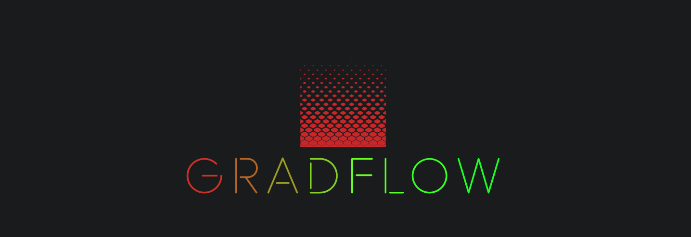

---
### A small, educational, numpy based deep learning framework with minimal PyTorch-like functionality.
---
## Implementation details
* Gradflow has support for various tools that are needed to train a neural network like: optimizers, datasets handling, activation functions and extensible model modules. 
* This gradient computation engine uses the [reverse accumulation](https://en.wikipedia.org/wiki/Automatic_differentiation#Reverse_accumulation) method of automatic differentiation which involves calculating the gradient from the outermost operation inwards.
* You only need numpy to run the basic setup.
* Stable numpy backend and experimental gpu (pycuda) backend. Similar to pytorch you can now specify a target device for Variables and Modules. It will default to "cpu" if the device is not provided.

---
## Usage
### Installing
Clone the project and just run:
```
make install
```

### Create you own model
Simply use the build in Module, define your inner layers and implement the forward method.
```python
    class ModuleExample(Module):
        def __init__(self) -> None:
            super().__init__()
            self.linear_1 = self.add_module(Linear(1, 32))
            self.linear_2 = self.add_module(Linear(32, 1))
        
        def forward(self, input: Variable) -> Variable:
            out = self.linear_1(input=input)
            out = relu(out)
            out = self.linear_2(input=out)
            return out
``` 

### Dataset
Generate the dataset features and labels, and create the gradflow Dataset.
```python
    X, y = datasets.make_regression(
        n_samples=100,
        n_features=1,
        n_informative=1,
        noise=10,
        coef=False,
        random_state=0
    )
    y = np.power(y, 2)

    dataset = Dataset(X, y, batch_size=1)
    return dataset
```

### Training
For training you have to iterate over the dataset, perform forward and backward pass, compute the loss and apply the optimizer step.
```python
    optimizer = NaiveSGD(model.parameters, lr=config["lr"])
    training_loss = []

    for epoch in range(epochs):
        epoch_loss = .0

        for X, y in dataset:
            pred_y = model(X)

            loss = (pred_y - y) @ (pred_y - y)
            epoch_loss += loss.data.item()

            loss.backward()
            optimizer.step()
            optimizer.zero_grad()

        epoch_loss /= len(dataset)
        training_loss.append(epoch_loss)
        print(f"Epoch {epoch} | Loss: {epoch_loss}")
```
### Examples
In the [examples](examples) folder you can find several other samples.

---
## Testing
Every module has unit tests, the structure of the tests folder follows the structure of the main gradflow structure.
